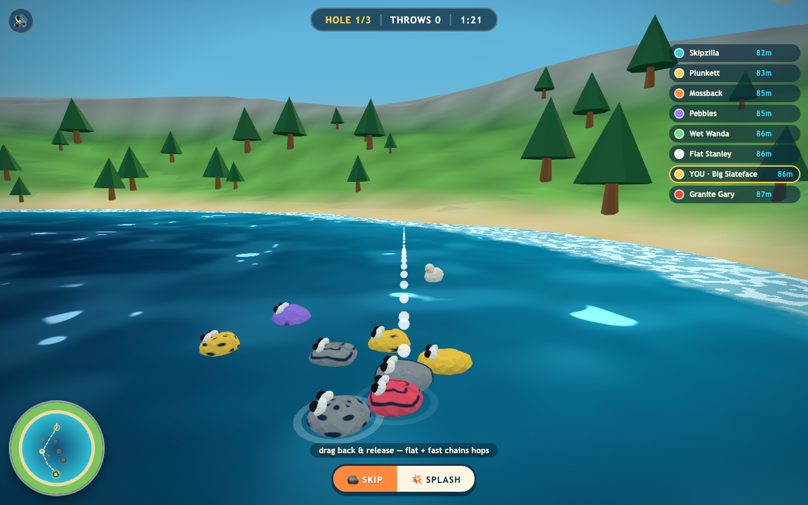
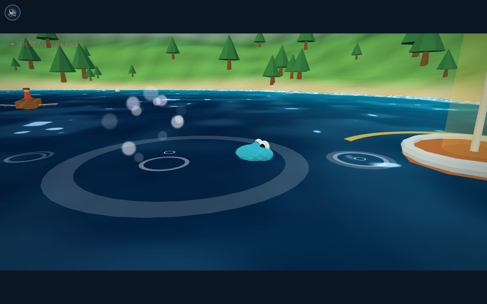
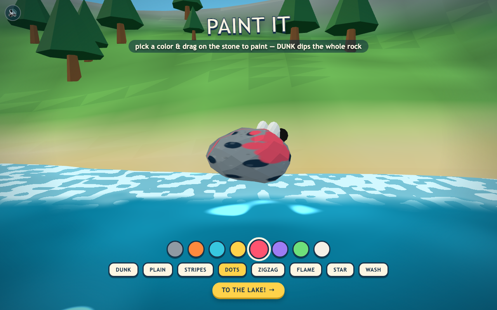
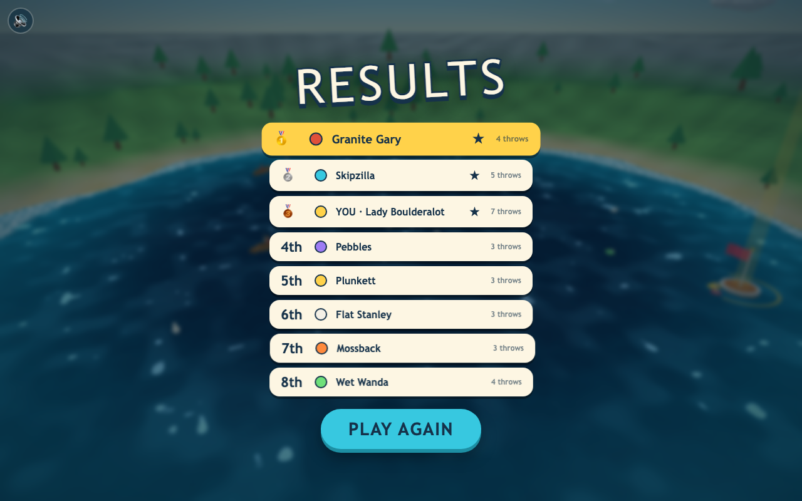

# 🪨 SKIMMERS — the rock-skipping race

**First stone to the flag wins.** Find a rock, grind it flat, paint it, then
skip it across a lake full of rivals, rowboats, islands and ducks.
2–8 players · online multiplayer · browser · 3D · ~3 minute matches.

**Play now → [skimmers-lake.vercel.app](https://skimmers-lake.vercel.app)**



## 🌐 Multiplayer

Serverless WebRTC (PeerJS): **Host a lobby**, share the 4-letter room code,
friends hit **Join**. Everyone preps their own rock while the lobby fills;
empty seats become bots (up to 8 racers). Each player's stone runs full
physics on their own machine — throws feel instant — while positions and
events stream peer-to-peer. The host referees: match clock, hole
transitions, winner calls, and the bot fleet.

## 🎮 How to play

```
find a rock → shape it → paint it → skip battle
```

| Verb | How |
|---|---|
| **Skip** | drag back & release — drag length is power, sideways drag steers. Flat + fast throws chain hops. |
| **Splash** | toggle 💥 (or press `X`) and lob your stone at a rival — knock theirs under and they have to fish it back |
| **Fish** | sank it? the camera dives underwater — steer the descending hook past the fish to your rock. Every fish you bump shoves the hook back up and costs you distance |
| **Island stop** | land on an island and you throw from dry sand — no drowning, no fishing |
| **Ferry** | land *in* a rowboat and it carries your stone across the lake |

Each hole is a fairway of buoys with doglegs and island rest stops — follow
the minimap. First stone inside the flag ring takes the hole; most holes wins.

## ✨ The juicy bits



- 📼 **Instant-replay killcam** — every winning throw is recorded on a flight
  tape and replayed letterboxed from a cinematic side angle
- 🔥 chain 5+ hops and your rock catches **fire**
- Squash & stretch on every skip, googly eyes that jiggle on springs
- Hitstop, slow-mo final approach, FOV kicks, trauma-based screen shake
- Fully procedural Web Audio — zero sound files; pitch-climbing skip plinks
- Brush-paint your stone by hand, pottery-wheel style



Sink your stone and the camera follows it down:


## 🏃 Run it locally

```sh
python3 -m http.server 8741        # or: npx serve .
# open http://localhost:8741
```

No build step. Plain ES modules; three.js comes from a CDN importmap.

## 🧠 Architecture notes

- [`src/physics.js`](src/physics.js) — the skip sim: water-entry angle +
  speed + rock flatness decide *skip / settle / sink*. `simulateThrow()` runs
  the identical step for the aim preview and the bot planner, so neither lies.
- [`src/bots.js`](src/bots.js) — 7 CPU personas play through the *same*
  `Skimmer` physics as you, navigating the fairway waypoint by waypoint with
  skill-scaled wobble.
- [`src/rock.js`](src/rock.js) — procedural stones: grindable lump field,
  layered canvas skin (base coat + brush strokes), spring-loaded googly eyes.
- [`src/minimap.js`](src/minimap.js) — course baked once per hole, live blips
  stamped on top.
- Reused team scraps: Spellbook's juice kit (hitstop/shake/springs), Train
  Slop's cel shader + inverted-hull outlines + procedural-audio pattern,
  Frankentoys' brush-paint splat, plus pooled-particle, journey-spline,
  mood-lighting, killcam and minimap recipes from the shared registry.



---

Built with [Claude Code](https://claude.com/claude-code) 🤖 — one session,
from empty folder to deployed game.
