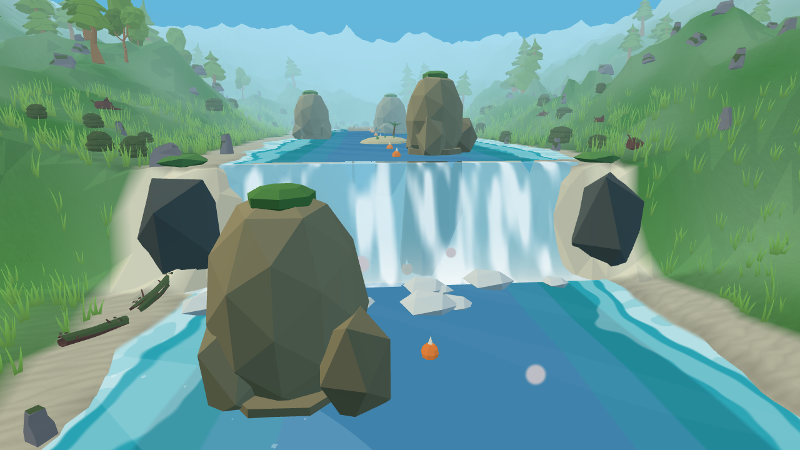

# Skippidy Skip — the rock-skipping race

**First stone to the flag wins.** Find a rock, grind it flat, paint it, then
skip it across a lake full of rivals, boats, islands and ducks.
2–8 players · online multiplayer · browser · 3D · ~3 minute matches.

**Play now → [skimmers-lake.vercel.app](https://skimmers-lake.vercel.app)**


## Multiplayer

Serverless WebRTC (PeerJS): pick a room size and hit **Find match**. There is
no matchmaking server either — everyone hunting for a room of that size probes
the same well-known peer ids, joining the first one with a free seat and
claiming it themselves if it's empty. Everyone preps their own rock while the
lobby fills; empty seats become bots (up to 8 racers). Each player's stone
runs full physics on their own machine — throws feel instant — while positions
and events stream peer-to-peer. The host referees: match clock, hole
transitions, winner calls, and the bot fleet.

## How to play

```
pick a rock off your bench → skip battle
             ↑ or make a new one: find → shape → paint → name it
```

Your finished stones keep their names and live on a park bench by the lake —
three floaters, three rocks. Tap one to race it again exactly as you left it,
or tap an empty floater to go and carve another.

| Verb | How |
|---|---|
| **Look** | drag sideways — a swipe across the screen spins you the whole way round the stone, and it costs no power, so you can read the hole before committing |
| **Skip** | drag *back* & release — how far back is the power, and it comes out flat and fast to chain hops |
| **Lob** | drag *forward* instead and the stone goes up rather than out, as steep as a mortar. It lands flat with zero skips, which is how you drop one into a pocket a skipper could never reach |
| **Splash** | tap the SKIP/SPLASH pill (or press `X`) and lob your stone at a rival — knock theirs under and they have to fish it back |
| **Fish** | sank it? the camera dives underwater — steer the descending hook past the fish to your rock. Every fish you bump shoves the hook back up and costs you distance |
| **Island stop** | land on an island and you throw from dry sand — no drowning, no fishing |
| **Ferry** | land *in* a boat and it carries your stone across the lake |
| **Rebound** | hit a hull side and the stone BOINGs off elastically — bank shots count toward your chain |
| **Duck under** | bridge decks and cave roofs are lids on the fairway — a lob that hits the underside is over, and the only line through is the flat one you'd normally never risk |
| **Time the wheel** | a mill paddle on the upswing flings your stone down the river; the same paddle a beat later swats it under |
| **Over the edge** | a stone that clears a waterfall lip keeps everything it had, and lands metres lower still skipping |

Each hole is a long river that runs the full width of the map, tee to
flag in one direction, with hard elbows and island rest stops along the way —
follow the minimap (tap it to blow it up). Giant rock spires wall off the straight line to the flag:
**CLONK** into one and your chain is dead (a high splash-lob can just clear
the shorter ones). The hole itself is a whirlpool with the flagpole planted
bare in the middle of it, and the swirl you can see is exactly the zone that
counts — put a stone *into* that water and it gets dragged under and you take
the hole. Sail over the top of it and nothing happens. Most holes wins.


Every hole in the lake steps down at least once. A waterfall is not a trick
laid on top of the river, it is what a river does, so the surface, the bed, the
banks and everything standing on them drop at each lip and the hole plays
downhill in terraces. **Long Water** shows you a single three-metre step
alongside the islands and the spires; **Stepwater** is three of them back to
back and almost no rock, because the drops are the hole; **Cataract Run** is
the same idea grown up, twelve metres in two.

The rest of the thirteen are a ladder, and each rung adds exactly one thing the
lake has not asked of you yet. **Bridgeworks** is three crossings, ending on a
trestle whose gaps are barely wider than a stone. **Millrace** strings three
undershot mill wheels down a narrow stream, each
on the opposite bank to the last. **The Undertow** runs dead straight into
twenty-two metres of tunnel with two pillars in the dark. **The Race** is the
first hole where the water moves, **The Chute** where some of it moves faster,
**The Slack** where the reeds hold on to you. **Deadfall** drops trees across
the river so the only headroom is against one bank; **The Lodge** walls it off
with beaver dams that are waterfalls in their own right; **Cold Snap** freezes
it so nothing skips and nothing sinks; and **The Split** finally offers you two
ways down and makes you pick one.

Cups walk that ladder two rungs at a time and close with an earlier hole
mirrored, reversed or narrowed, so twenty-one tracks come out of thirteen holes
without a cup ever repeating a lesson. A reversed hole re-cuts its own terraces
from its new tee, so it still runs downhill. `npm test` enforces both the
one-new-thing rule and the drop on every hole as build gates.



## The juicy bits


- **Instant-replay killcam** — every winning throw is recorded on a flight
  tape and replayed letterboxed from a cinematic side angle
- chain 5+ hops and your rock catches **fire**
- Squash & stretch on every skip, googly eyes that jiggle on springs
- Hitstop, slow-mo final approach, FOV kicks, trauma-based screen shake
- Fully procedural Web Audio — zero sound files; pitch-climbing skip plinks
- Brush-paint your stone by hand — drag the water to spin & tilt it under your brush


Sink your stone and the camera follows it down:


## Run it locally

```sh
npm run dev
# open http://localhost:8741
```

No build step. Plain ES modules; three.js comes from a CDN importmap.

Served locally, `` ` `` opens the debug menu
([`src/tweakmenu.js`](src/tweakmenu.js)). **Levels** opens every cup and class in
one click and then jumps the live race to any hole in any of them, which is how
you get eyes on a waterfall without playing four cups to earn it. **Biome** puts
any of the weathers on the hole that's up. The scene colour, gradient and water
controls are folded away underneath it; they write into the live materials and
persist to localStorage, and the Share panel exports the lot as JSON — though a
hole change reapplies its biome over the top of them. None of it ships — the
menu is only wired up on localhost.

## Architecture notes

- [`src/physics.js`](src/physics.js) — the skip sim: water-entry angle +
  speed + rock flatness decide *skip / settle / sink*. `simulateThrow()` runs
  the identical step for the aim preview and the bot planner, so neither lies.
- [`src/bots.js`](src/bots.js) — 7 CPU personas play through the *same*
  `Skimmer` physics as you, navigating the fairway waypoint by waypoint with
  skill-scaled wobble. Their *pace* is on a rubber band measured along the buoy
  line: a rival that runs away from the field takes longer over every throw and
  every fishing break and lets its aim drift, so the hole stays live instead of
  being decided in the first thirty seconds. The band only ever brakes — a rival
  that's been dropped is left dropped, and no stone is ever handed a truer line
  than its persona earns — until the last person is home, when the stragglers
  get a hurry-up so the final stretch isn't spent watching stones you've already
  beaten. `npm test` races it against a scripted human to prove it never costs
  the player a place.
- [`src/rock.js`](src/rock.js) — procedural stones: a drillable voxel field
  meshed by marching cubes, packed tighter (and darker, and slower to cut) the
  closer to its middle you get. A bite that would snap the stone in two is
  refused rather than taken, so the neck holding it together is the one thing the
  drill won't cut. Plus a layered canvas skin (base coat + brush strokes) and
  spring-loaded googly eyes that glance at whichever rival stone is nearest.
- [`src/marchingcubes.js`](src/marchingcubes.js) — the isosurface mesher, with
  its triangle table derived at load time rather than typed in by hand.
- [`src/fish.js`](src/fish.js) — the three sculpted fish that guard a sunken
  stone. They have no skeleton: a vertex shader bends each body with scrolling
  Perlin noise, weighted head-to-tail so the nose holds steady and the tail
  whips, and anchored to the fish's world position so every one swims on its own
  phase. Geometry is baked out of `assets/models/*.fbx` by
  `npm run bake:fish` — the game still fetches nothing at runtime.
- [`src/foliage.js`](src/foliage.js) — the forest and the undergrowth under it,
  re-scattered per hole and banded by height up the bank: willows at the
  waterline, birch on the slopes, pine alone on the crests, with bushes, ferns,
  flowers, mossy boulders and fallen logs filling in between. Models are
  Quaternius' Ultimate Nature Pack (CC0), baked out of OBJ by
  `npm run bake:nature` into delta-coded arrays that ship in the bundle, so this
  fetches nothing at runtime either. One instanced draw per model, and a shared
  vertex-shader wind that stirs canopies and leaves but not rock.
- [`src/eyeconfig.js`](src/eyeconfig.js) — where the pupils sit in each face of
  the eye sheet. Re-measure the whole sheet with
  `node scripts/measure-eyes.mjs`, drag the sockets by hand in the Eyes Lab at
  `/admin` (edits save live to any open game tab), and eyeball every face at
  once at `/eyecheck.html`.
- [`src/props.js`](src/props.js) — the hole furniture: waterfall curtains, mill
  wheels, bridges and caves. It is split by what the aim preview can
  honestly promise. Anything that stands still hands itself to the sim as an
  ordinary outcrop or a ceiling, so it CLONKs, shows in the dotted line and the
  bots route around it; anything that *moves* is deliberately invisible to the
  preview, because a mill paddle's whole value is that you have to time it.
- [`src/water.js`](src/water.js) — the lake, and the falls that make it stop
  being flat. A lip is a half-plane: everything upstream of it — surface, bed,
  banks, props, particles, the fishing minigame — rides one drop higher, which
  is why `waterLevelAt(x, z)` rather than a constant is the only honest way to
  ask where the water is.
- [`src/biomes.js`](src/biomes.js) — the same lake in a different country. Sky,
  fog, sun, lights, bank gradient, beach, water bands, tree species mix and
  undergrowth wash are authored as one bundle per biome and applied in a single
  call at the top of `setupHole`, because a look only works if every layer of it
  is from the same afternoon. Each cup wears one, which is most of what stops
  the transformed track at the back of each cup from reading as the hole you
  played a cup ago; a hole can overrule its cup when it has to, which is how a
  sheet of ice avoids turning up in high summer.
- [`src/holes.js`](src/holes.js) — the thirteen holes, in teaching order. Every
  one introduces exactly one element no hole before it had and may keep any of
  the ones already taught, which is a rule worth enforcing rather than
  intending: a hole that brings two new things at once teaches neither, and a
  hole that brings none is a hole you have already played. `npm test` counts the
  rungs and fails the build on both.
- [`src/holerules.js`](src/holerules.js) — what makes an authored hole a legal
  hole: straightness, leg length, furniture on the line and clear of each other,
  a waterfall crossed exactly once and downhill. `npm test` fails the build on
  them ([`scripts/checkholes.mjs`](scripts/checkholes.mjs)) and the level editor
  at `/admin` runs the identical rules as you drag, so a dam shoved into the
  bank complains while your finger is still on it. The editor places every kind
  of furniture now, not just the fairway.
- [`src/channel.js`](src/channel.js) and [`src/route.js`](src/route.js) — a hole
  need not be one river. A hole may carry `branches`: a narrower channel that
  leaves the main line and rejoins it further down, cutting a corner off at the
  price of having less water to miss with. `channel.js` reduces the whole hole
  to a list of legs with a width each, and every part that asks *where is the
  water* — the surface shader, the carve of the ground, the minimap raster, the
  rules — answers from that one list, so the two lines cannot disagree about
  where their banks are. `route.js` is the other half: with two ways down, "how
  far to the flag" is no longer a walk along one polyline, so it keeps a little
  graph and answers by shortest remaining distance. That is what ranks the field
  on a timeout and what lets a rival read a fork at all — nerve takes the gut,
  caution stays out on the river.
- [`src/minimap.js`](src/minimap.js) — course baked once per hole, live blips
  stamped on top, in the biome's own colours. Both lines of a fork are drawn,
  the shortcut dashed; on the water itself only the main line is buoyed, so the
  shortcut is something you have to see for yourself.
- Reused team scraps: Spellbook's juice kit (hitstop/shake/springs), Train
  Slop's cel shader + inverted-hull outlines + procedural-audio pattern,
  Frankentoys' brush-paint splat, plus pooled-particle, journey-spline,
  mood-lighting, killcam and minimap recipes from the shared registry.


---

Built with [Claude Code](https://claude.com/claude-code) — one session,
from empty folder to deployed game.
